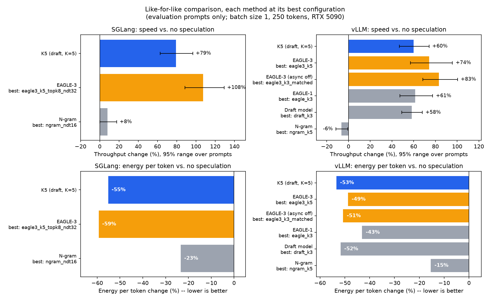
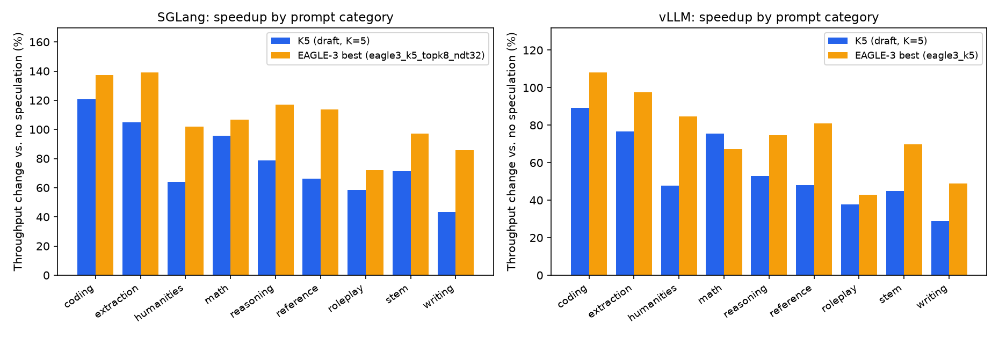

# Fixed-K Speculative Decoding vs. EAGLE-3: A Like-for-Like, Energy-Measured Comparison

[](https://opensource.org/licenses/Apache-2.0)
[](https://doi.org/10.5281/zenodo.22210487)
[](https://sdsie.github.io/)
[](https://sdsie.github.io/)

**K5** is draft-model speculative decoding with a fixed draft window: a small model
(Llama-3.2-1B-Instruct) proposes K=5 tokens, the target model (Llama-3.1-8B-Instruct)
verifies them in one pass and keeps the longest prefix it agrees with.

This is **not a new algorithm**. It is the classic method of Leviathan et al. and Chen
et al. (2023), and it already ships as `draft_model` in vLLM, `STANDALONE` in SGLang and
assisted generation in Hugging Face Transformers. What this repo contributes is
**careful measurement**: a like-for-like benchmark of this configuration against EAGLE-3,
EAGLE-1 and n-gram drafting inside two production engines, with GPU energy per token
measured from the hardware energy counter.

## Key findings (batch size 1, RTX 5090, 27 prompts, 2 repetitions)

| | SGLang 0.5.20 | vLLM 0.27.1 |
|---|---|---|
| K5 throughput vs. no speculation | **+79%** | **+60%** |
| K5 energy per token vs. no speculation | **−55%** | **−53%** |
| Best EAGLE-3 throughput vs. no speculation | +108% (tree config) | +74% |
| **K5 speed vs. best EAGLE-3** | **−13.6%** [−19.0, −8.5] | **−8.2%** [−14.5, −1.5] |
| **K5 energy per token vs. best EAGLE-3** | **+10.2%** (more) | **−9.1%** (less) |

*Evaluation prompts only (13 of 27; see [the protocol](#how-the-comparison-is-kept-fair)).
Brackets are 95% ranges.*

In plain terms:

- **K5 roughly halves GPU energy per token** and raises throughput by 60–79%, in both
  engines.
- **A well-configured EAGLE-3 is faster** than K5 in both engines, by 8–14%. On energy
  per token it's a split decision: K5 uses less in vLLM and more in SGLang.
- **K5 reaches about 74–81% of EAGLE-3's speed gain without needing a trained EAGLE
  head.** EAGLE-3 only works where someone has trained a draft head for your exact
  target model. A draft model works with any small model from the same family, which
  makes it the practical option for fine-tuned, custom or newly released models.
- **K=5 is the right window.** No other window tested was measurably better.
- **K5 beats n-gram drafting by ~66–71%** in speed, and ties EAGLE-1 in vLLM.



EAGLE-3's lead is smallest on math, coding and roleplay prompts, and largest on humanities
prompts and the three reference prompts. In vLLM, K5 is ahead on the math category.



## Full results

All numbers below are from `telemetry/likeforlike/20260925_035521_full/report.md`.
Speed and energy are relative to no speculation in the same engine; all 27 prompts.
Accept length = tokens produced per target verification step.

**SGLang 0.5.20** (baseline drift within a block: 1.5%)

| Config | Speed [95%] | Energy/token | Accept len |
|---|---|---|---|
| EAGLE-3, tree (5 steps, top-k 8, 32 tokens) | +106.8% [+94.7, +119.7] | −59.2% | 3.53 |
| **K5 (draft, K=5)** | **+76.7% [+66.1, +88.3]** | −54.3% | 4.28 |
| Draft, K=7 | +74.0% [+60.4, +89.7] | −52.9% | 5.07 |
| Draft, K=3 | +65.8% [+58.6, +73.2] | −51.5% | 3.20 |
| EAGLE-3, K=5 (chain) | +55.2% [+45.1, +66.4] | −47.7% | 2.46 |
| EAGLE-3, K=3 (chain) | +53.8% [+46.5, +62.5] | −48.8% | 2.20 |
| N-gram (16 draft tokens) | +8.0% [+2.7, +13.8] | −23.2% | 1.41 |
| EAGLE-1, K=5 — *excluded, not speculating* | −44.1% | +49.2% | 1.01 |

**vLLM 0.27.1** (baseline drift within a block: 4.1% — above the 3% warning threshold,
so treat small differences with caution)

| Config | Speed [95%] | Energy/token | Accept len |
|---|---|---|---|
| EAGLE-3, K=3, async scheduling off | +79.6% [+70.4, +90.2] | −50.1% | 2.21 |
| EAGLE-3, K=5, async scheduling off | +76.1% [+64.0, +89.1] | −50.0% | 2.47 |
| EAGLE-3, K=3 | +74.0% [+64.9, +84.2] | −49.4% | 2.21 |
| EAGLE-3, K=5 | +73.8% [+62.2, +86.1] | −48.9% | 2.47 |
| EAGLE-3, K=2 | +65.8% [+59.4, +72.5] | −47.3% | 1.99 |
| EAGLE-1, K=3 | +59.7% [+51.4, +68.9] | −42.2% | 2.27 |
| Draft, K=3 | +56.6% [+50.6, +63.2] | −51.3% | 3.18 |
| **K5 (draft, K=5)** | **+54.6% [+45.3, +64.7]** | −51.7% | 4.19 |
| Draft, K=7 | +48.7% [+37.1, +61.7] | −49.3% | 4.93 |
| EAGLE-1, K=5 | +45.3% [+35.8, +56.3] | −36.4% | 2.43 |
| N-gram, K=5 | −7.6% [−10.9, −4.1] | −14.1% | 1.93 |

In SGLang, EAGLE-3 in chain mode is *slower* than K5. Only its tree configuration
overtakes K5. Turning off vLLM's async scheduling made EAGLE-3 *faster* (see below).

## How the comparison is kept fair

The benchmark is `benchmarks/likeforlike_suite.py` (details in the docstring of
`likeforlike_worker.py`). The rules, and why each exists:

- **Same engine only.** vLLM is compared with vLLM, SGLang with SGLang. Numbers from
  different engines are never set against each other, since they differ by engineering,
  not algorithm.
- **Every method gets several configurations**, not one fixed K. The best configuration
  of each method is chosen on 14 prompts and reported on the other 13, so no method is
  graded on the data it was tuned on.
- **Each timed prompt is generated once per engine process.** Repetitions happen in
  fresh processes. This stops methods with cross-request memory from "drafting" their
  own previous answer to an identical prompt. This is the likely cause of an earlier
  implausible SGLang n-gram result (>900 tok/s), which dropped to +8% under this rule.
- **Warmup uses separate, never-timed prompts.** Prefix caching is off in both engines.
- **Every block of runs starts and ends with a baseline run.** Configuration order is
  randomized (seed recorded), and speedups are computed per prompt against the same
  block's baselines.
- **Automatic sanity checks.** A configuration is excluded from "best" if its accept
  length is ~1 (not really speculating), or if its speedup exceeds its accept length
  (physically impossible). SGLang's EAGLE-1 was excluded this way.
- **Prompts:** the three reference prompts below, plus 24 original prompts in the eight
  categories used by MT-Bench (not the MT-Bench questions themselves).

**Remaining asymmetries, stated plainly:**

- In SGLang, tree drafting was tested for EAGLE-3 but not for the draft model.
- vLLM runs `draft_model` on its older V1 model runner with async scheduling off, and
  runs EAGLE-3 on the newer V2 runner (both confirmed in vLLM's own logs). The "async
  scheduling off" EAGLE-3 rows match one of these two differences. Disabling async
  scheduling made EAGLE-3 faster, not slower, so it is not a handicap to K5. The
  model-runner difference is not matched.
- vLLM's EAGLE-3 was tested in chain mode only.

Any of these could shift the margins. We don't expect them to reverse the speed ordering,
but that hasn't been tested.

## Output fidelity: what "lossless" does and doesn't mean

With greedy decoding, speculative decoding is lossless **in exact arithmetic**: every
accepted token is the target model's own choice. In practice, inside these engines in
bfloat16, the output of **every speculative method tested** (EAGLE-3 included) differs
from the same engine's non-speculative output at some point in most responses. On
average, 52–72% of each response matches before the first differing token, and 30–48%
of responses are fully identical. By contrast, two non-speculative runs of the same
engine matched each other 100%.

Verification processes several tokens per forward pass, and the resulting rounding
differences can flip near-tied choices. This affects all methods alike, including
SGLang's EAGLE-1 run, which accepted almost no drafts. It is not specific to K5.

## Controlled mechanism isolation (cache-free harness)

Separately, `benchmarks/benchmark_ablation.py` reimplements the draft-verify loop in
plain PyTorch/Transformers with **no KV-cache in either arm**, so both arms do identical
full recomputation and only the mechanism differs. Absolute throughput is therefore far
below a real server. The *relative* comparison is the result. Measured 2026-09-05:
N=10 trials per prompt, closed-loop warmup converged, residual drift R² ≤ 0.037, and
**100% token-for-token fidelity** on every prompt.

| Prompt | Baseline tok/s | Speculative tok/s | Speedup | Energy/token Δ | Accept % |
|---|---|---|---|---|---|
| Poem | 40.16 ± 0.28 | 43.55 ± 0.31 | +8.4% | −32.7% | 42.5% |
| Physics | 40.05 ± 0.18 | 49.64 ± 0.43 | +24.0% | −39.2% | 51.7% |
| Code | 40.04 ± 0.23 | 73.46 ± 0.74 | +83.5% | −60.8% | 85.4% |


Gains grow with the draft accept rate, as the mechanism predicts. That rate depends on
how *predictable the next token* is, not on how hard the task is for a person. Code has
rigid syntax, so the draft model's guesses are usually right (85% accepted). Open verse
has many equally good word choices at almost every position (43%).


These accept rates agree closely with those from vLLM's own, independent draft-model
implementation on the same three prompts (43.3 / 57.8 / 85.0%).

**A KV-cached version of this plain Python harness does not reproduce a speedup**
(`benchmark_cached_ablation.py`). In eager Python, the per-call overhead makes one call
of the 1B draft model cost a large fraction of one call of the 8B target, which removes
the draft model's advantage. That explanation comes from a cost model whose predictions
match the measurements; per-call times were inferred, not measured directly. The
practical point: with caching on, the mechanism needs an optimized engine to pay off,
which is exactly what the engine comparison above measures.

## What this does NOT claim

- **Not faster than EAGLE-3.** A properly configured EAGLE-3 is faster in both engines.
- **Not a new algorithm.** It is the standard draft-model method, measured carefully.
- **Only batch size 1.** Datacenter serving usually batches many requests, and the
  benefit of speculative decoding is known to depend on batch size. These energy results
  should not be extrapolated to batched serving without measuring it.
- **One model pair, one GPU** (RTX 5090 under WSL2, no clock locking), 250-token
  responses, two repetitions per configuration.
- **No dynamic/entropy-gated draft length.** An entropy-gated variant was tested in the
  parent SDSIE project and has not, so far, beaten the fixed window in single-request
  testing.

## Earlier engine comparisons (superseded)

`benchmark_vllm_comparison.py`, `benchmark_vllm_spec_methods.py` and
`benchmark_sglang_spec_methods.py` (September 18–21) were first attempts at this
comparison. They held every method at K=5 and used only three prompts, which favoured
K5: EAGLE-3 was never tried at its best settings. Their telemetry stays in `telemetry/`
for the record, but their numbers are superseded by the like-for-like results above
and shouldn't be cited.

## Methodology notes

- **Energy** is read from the GPU's hardware energy counter
  (`nvmlDeviceGetTotalEnergyConsumption`) at the start and end of each timed request.
  Power and temperature are sampled at 100 Hz for warmup and drift checks.
- **Warmup** is closed-loop: it runs real generations until each prompt's own power and
  temperature readings stop drifting (a half-split drift test with tolerances relative to
  each prompt's own mean), and never less than 150 s in the engine comparison. The full
  history of how this procedure was developed and debugged is in the
  `warm_to_steady_state` docstring in `bench_common.py`.
- **Statistics:** per-prompt speedups are combined with a geometric mean. The 95% ranges
  are bootstrap intervals over prompts (2000 resamples).

## Repository structure

```
benchmarks/
  likeforlike_suite.py      - Runs the like-for-like comparison (source of the main results)
  likeforlike_worker.py     - One engine + one configuration per process
  likeforlike_analyze.py    - Statistics, sanity checks, report.md / summary.json
  plot_likeforlike.py       - Figures for the like-for-like results
  benchmark_ablation.py     - Cache-free mechanism isolation (N=10 trials, 3 prompts)
  speculative_scout.py      - Single-run version of the same cache-free loop
  bench_common.py           - Shared NVML monitor, closed-loop warmup, decode loop, drift checks
  benchmark_cached_ablation.py - KV-cached plain-Python harness (does not reproduce a speedup; see above)
  benchmark_vllm_comparison.py, benchmark_vllm_spec_methods.py,
  benchmark_sglang_spec_methods.py - Earlier engine comparisons (superseded)
  plot_ablation_results.py  - Figures for the cache-free harness
docs/
  fixed_k5_paper.tex / .pdf - The paper (figures drawn in LaTeX; compiles on its own)
telemetry/
  likeforlike/<run>/        - Report, summary, per-run JSON and logs for each suite run
  ablation_results.json     - Cache-free harness results
  (other files)             - Earlier runs, kept for the record
assets/                     - Figures used in this README
requirements-vllm.txt       - vLLM environment (pinned)
requirements-sglang.txt     - SGLang environment (pinned)
requirements.txt            - Cache-free harness environment (minimum versions)
```

## Running it

The engine comparison needs **two separate environments**: vLLM and SGLang require
different versions of shared packages and can't be installed together. The cache-free
harness runs in a third, plain PyTorch environment.

| File | Environment for | Versions |
|---|---|---|
| `requirements-vllm.txt` | vLLM runs of the like-for-like suite, plot scripts | pinned to what the published results used |
| `requirements-sglang.txt` | SGLang runs of the like-for-like suite | pinned to what the published results used |
| `requirements.txt` | cache-free harness (`benchmark_ablation.py` etc.) | minimums only (see the note in the file) |

```bash
python -m venv .vllmvenv && .vllmvenv/bin/pip install -r requirements-vllm.txt
python -m venv .sglangvenv && .sglangvenv/bin/pip install -r requirements-sglang.txt
```

```bash
cd benchmarks

# Like-for-like engine comparison. vLLM and SGLang usually live in separate
# environments: pass each one's python. Plumbing test without a GPU first:
python likeforlike_suite.py --engines mock --preset quick

# Short real test (3 prompts, a few configurations, ~1 hour):
python likeforlike_suite.py --engines vllm,sglang --preset quick \
    --vllm-python /path/to/vllm-env/bin/python \
    --sglang-python /path/to/sglang-env/bin/python

# Full comparison (27 prompts, all configurations, 2 repetitions; several hours):
python likeforlike_suite.py --engines vllm,sglang --preset full --reps 2 \
    --vllm-python /path/to/vllm-env/bin/python \
    --sglang-python /path/to/sglang-env/bin/python

# Figures from a finished run:
python plot_likeforlike.py ../telemetry/likeforlike/<run>/summary.json

# Cache-free mechanism isolation (loads both models with Transformers):
python benchmark_ablation.py
```

Needs an NVIDIA GPU with room for a ~1B and a ~8B model in bfloat16 (about 18–20 GB),
and access to the gated `meta-llama/Llama-3.2-1B-Instruct` and
`meta-llama/Llama-3.1-8B-Instruct` checkpoints on Hugging Face. Each results file
records the exact library versions it was produced with. The package versions behind
the cache-free table (2026-09-05) were not recorded, so `requirements.txt` gives
minimum versions only.

## Relationship to SDSIE

This repo began as an extraction from the broader
[SDSIE](https://github.com/Creepybits/software-defined-stochastic-inference-engine)
research project, where this fixed-window piece was the part found to be real and
reproducible. SDSIE's more ambitious mechanisms (entropy-gated draft length, entropy-gated
precision switching) have been tested and so far have not beaten this simpler approach.
The two codebases have since diverged. Results in one do not carry over to the other.

## License

Apache-2.0.
