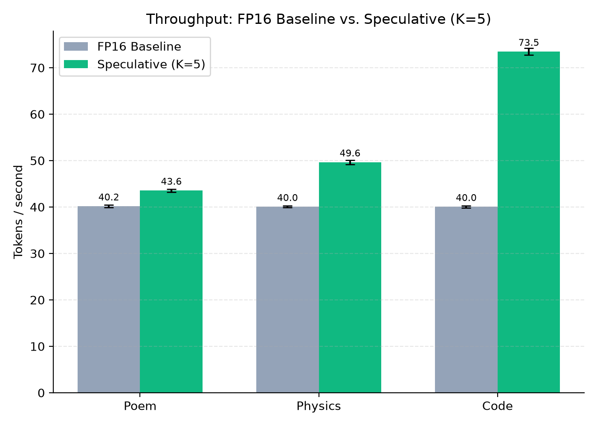
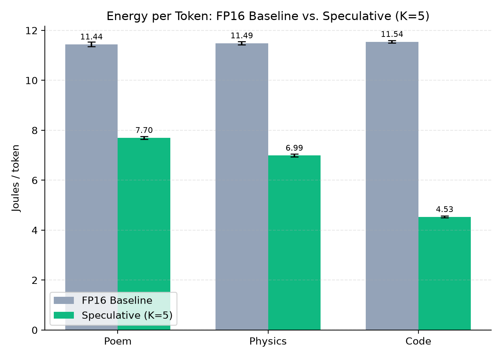
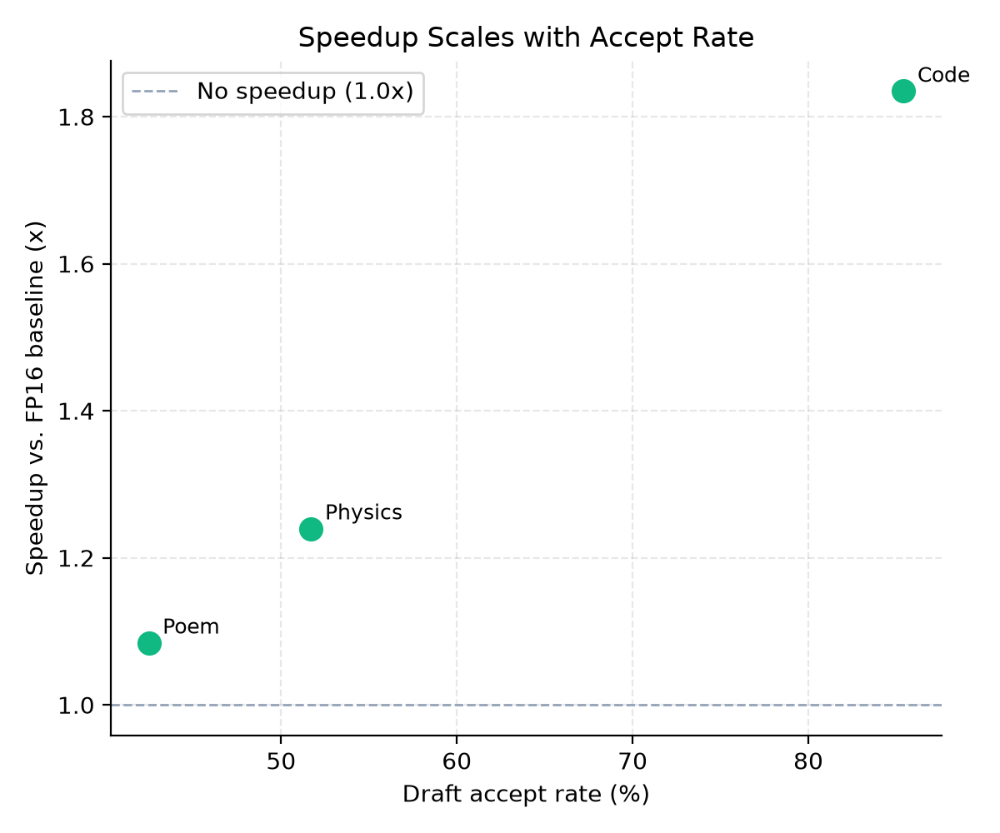

# Fixed-K Speculative Decoding: Real, Reproducible Energy & Speed Gains  

[](https://opensource.org/licenses/Apache-2.0)
[](https://doi.org/10.5281/zenodo.22210487)
[](https://sdsie.github.io/)
[](https://sdsie.github.io/)  
___
Part of the broader [SDSIE](https://github.com/Creepybits/software-defined-stochastic-inference-engine)
research project, which also explores entropy-gated dynamic speculation and INT4
quantization — pieces still under active investigation, not included here. This repo
contains only the specific mechanism (fixed-K speculative decoding) that's fully
validated and reproducible as claimed. See [Relationship to SDSIE](https://github.com/Creepybits/sdsie-fixed-k5-speculative-decoding#relationship-to-sdsie) below for more.  
___

Real scout(1B)→target(8B) speculative decoding with a lossless verify/rollback loop,
fixed draft window K=5. **Every number below is real, independently reproduced, and
traceable to a script in this repo.**

This is a spin-off of a specific, working piece from a larger, more experimental
research project ([SDSIE](https://github.com/Creepybits/software-defined-stochastic-inference-engine)),
which also explores entropy-gated *dynamic* speculation and INT4 quantization. Those
pieces are still under active investigation and are **not** included here — this repo
contains only the part that's fully validated and works as claimed.

## Results (N=10 trials/prompt, RTX 5090 Blackwell, 100% output fidelity on all rows)

*Updated 2026-09-04. Supersedes the numbers previously reported here — a warmup-timing
bug was found and fixed (see [Methodology](#methodology) below); the relative story is
unchanged, but every figure below is a fresh, re-measured number, not a revision of the
old ones by formula.*

| Prompt | Baseline tok/s | Speculative tok/s | Speedup | Baseline J/tok | Speculative J/tok | Energy Δ | Accept % |
|---|---|---|---|---|---|---|---|
| Poem | 38.42 ± 0.18 | 40.98 ± 0.35 | +6.7% | 11.66 ± 0.11 | 7.91 ± 0.10 | −32.2% | 42.5% |
| Physics | 38.45 ± 0.50 | 47.03 ± 0.42 | +22.3% | 11.64 ± 0.11 | 7.18 ± 0.12 | −38.3% | 51.7% |
| Code | 38.90 ± 0.67 | **69.44 ± 0.73** | **+78.5%** | 11.66 ± 0.12 | **4.74 ± 0.09** | **−59.3%** | **85.4%** |




Speedup and energy reduction scale with draft-acceptance rate — higher on predictable
content (code), lower but still real on less predictable content (free-form prose).



Accept rates were independently cross-validated across every run of this ablation to
date — including today's, after a full rewrite of the measurement harness — and match
to within a few hundredths of a percentage point every time (deterministic greedy
decoding), which is strong evidence the accept/reject logic itself has been correct and
stable throughout, independent of the measurement-methodology fixes described below.
Mean GPU power during speculative runs (344–363 W) is lower than during the FP16
baseline (466–469 W) despite two resident models, consistent with fewer full
8B-parameter forward passes required per unit of output as accepted draft batches grow.

## What this does NOT claim

- No quantization/kernel work is included here (see the parent SDSIE repo for that,
  including a report of where it currently helps and where it doesn't).
- No dynamic/entropy-gated draft-length adjustment — K is fixed at 5. An entropy-gated
  version was tested and, as of the parent project's latest findings, does not yet
  outperform this fixed-K approach in single-request testing. This repo intentionally
  ships the simpler, proven approach rather than the more ambitious, not-yet-validated one.
- No KV-cache (deliberate, for a fair baseline-vs-speculative comparison — see
  "Methodology" below). Absolute throughput numbers here are not production-representative;
  the relative comparison (baseline vs. speculative under identical conditions) is what's
  been validated.

## Methodology

Both baseline and speculative paths run with **no KV-cache** (full recompute each step).
This was a deliberate choice to keep the comparison fair — an earlier version of this
work applied caching unevenly, which structurally penalized the speculative path on any
fallback step. Recomputing from scratch for both arms removes that confound, at the cost
of both being slower in absolute terms than a production server with caching would be.

Warmup happens in two layers. Before any timed trial, a **closed-loop thermal warmup**
runs real (discarded) baseline and speculative decoding cycles, alternating across all
three prompts and both conditions, until GPU temperature stops moving and *each*
prompt/condition combination's own power reading individually stops moving — not until
consecutive readings across different combinations happen to agree with each other,
since baseline and speculative draw genuinely different power by design. This replaced
an earlier fixed-length warmup that recovered only part of the GPU's cold-start power
deficit (see `bench_common.py`'s `warm_to_steady_state` for the full history: a warmup
burst shorter than the real trial length was found to converge at a lower power/temp
level than the real, longer trial then reached). On top of that, each individual timed
trial is still preceded by 5 short untimed warmup forward passes immediately before
measurement starts, avoiding cold-SM effects at the start of each specific trial. This
two-layer warmup procedure is shared between `benchmark_ablation.py` and
`speculative_scout.py` via `bench_common.py`.

Energy per token is read from the GPU's onboard hardware energy counter
(`nvmlDeviceGetTotalEnergyConsumption`) when available — as it was for every trial in
the results above — rather than integrated from sampled power readings, which is a more
direct and less bias-prone measurement; sampled trapezoidal integration is retained as a
fallback and cross-check when the counter isn't supported. Power itself is still sampled
via 100 Hz NVML polling. Fidelity is measured as exact greedy-decoding token match
between baseline and speculative output.

### Measurement validity (drift check)

Each reported run's per-trial telemetry is checked for residual warmup drift: a
least-squares fit of power, energy/token, and throughput against chronological trial
index. For the run behind the table above, the fitted trend was negligible in every
case (R² ≈ 0 for all three metrics, pooled and per-condition — the largest was 0.09),
and the total drift over the full 60-trial run was small in absolute terms (about −2 W
over the whole run, against a pooled mean near 410 W). The script's own pass/fail
threshold (±0.5% of mean) is a blunt cutoff that doesn't look at R², so it did flag this
run (pooled: −0.53%; speculative-only: −0.58%; baseline-only passed at −0.48%) — worth
knowing about, but a near-zero R² alongside a sub-1%-of-mean total change is consistent
with ordinary run-to-run noise, not a systematic warmup or thermal trend contaminating
the reported means. Separately, on this specific run the closed-loop warmup itself did
not fully converge within its 420 s cap (WSL2 GPU passthrough appears to add enough power
reporting noise that the strict per-label 1.5 W tolerance wasn't reliably satisfied in
time) — the drift check above is exactly the safeguard that exists for this situation,
and it came back clean.

## Repository structure

```
benchmarks/
  speculative_scout.py    - Standalone reference implementation, single-run
  benchmark_ablation.py   - N=10 trial ablation across 3 prompts (source of table above)
  bench_common.py         - Shared NVML monitor, closed-loop warmup, accept/reject decode
                             loop, and drift diagnostics used by benchmark_ablation.py and
                             speculative_scout.py
  plot_ablation_results.py, rebuild_summary.py
docs/
  sdsie_fixed_k5_paper.tex / .pdf  - The paper (see below), figures pulled from assets/
telemetry/                 - Raw JSON/CSV output from the runs behind the table above
assets/                    - Plots generated from telemetry (see plot_*.py scripts)
```

## Running it

```bash
pip install -r requirements.txt
cd benchmarks

# Single run against one prompt
python3 speculative_scout.py

# Full N=10 ablation (takes several minutes, loads two models)
python3 benchmark_ablation.py

# Regenerate plots from the latest telemetry
python3 plot_ablation_results.py
```

Requires an NVIDIA GPU with enough VRAM for both a ~1B and ~8B parameter model in
bfloat16 (roughly 18-20 GB total), and access to the `meta-llama/Llama-3.2-1B-Instruct`
and `meta-llama/Llama-3.1-8B-Instruct` checkpoints (gated on Hugging Face — request
access first if you haven't already).

## Relationship to SDSIE

This repo exists because the parent SDSIE project's own correction process (see its
README) found that a claimed unified system (quantization + entropy-gated speculation)
wasn't actually wired together end-to-end, while this specific fixed-K speculative
decoding piece was real and independently reproducible. Rather than keep the validated
and experimental results bundled together, this repo isolates the part that's proven,
so it can be evaluated on its own terms without the open research questions attached.

## License

Apache-2.0.
